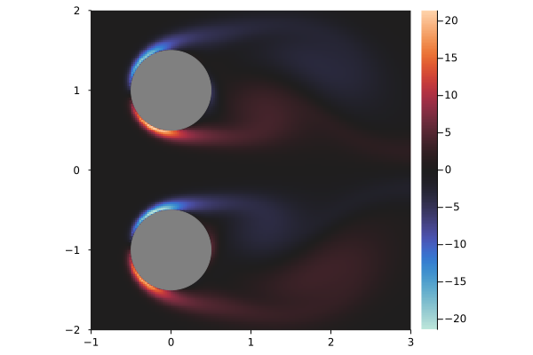

```@meta
CurrentModule = IBPM
```

# Tutorial: Double Cylinders

In this example, we will simulate the flow past two rigid cylinders. The general workflow is:
- Define the problem
    - Grid
    - Bodies
    - Freestream velocity
    - Reynold's number
    - Time step
- Define callbacks
- Solve the problem

## Defining the Problem

```julia
using IBPM
```

The first step is to define the grid.

```julia
xlim = (-1.0, 3.0) # x bounds
ylim = (-2.0, 2.0) # y bounds
dx = 0.02          # Grid step size
mg = 3             # Number of subdomains
mgrid = MultiGrid(dx, (xlim, ylim); mg=mg)
```

`MultiGrid` specifies multiple grids overlayed on top of each other. The x and y
limits specify the smallest grid, and each grid is twice the side length as the
previous.

Next, we define the bodies. In this case, we will specify two cylinders of
radius `0.5`. The [`IBPM.Bodies`](@ref) module contains various default bodies,
including a cylinder.

```julia
using IBPM.Bodies

r = 0.5
bodies = [
    Bodies.cylinder((0.0, -1.0), r, dx)
    Bodies.cylinder((0.0, +1.0), r, dx)
]
```

To specify arbitary bodies, see [`RigidBody`](@ref).

Then, the remaining quantities are specified and the [`IBProblem`](@ref) is constructed.

```julia
# Freestream velocity
freestream(t) = (1.0, 0.0)

Re = 100.0 # Reynolds number
dt = 0.004 # Time step size

prob = IBProblem(mgrid, bodies, freestream; Re=Re, dt=dt)
```

The [`solve`](@ref) function solves the problem. By default, no results are
displayed or returned. In order to get results, you must use a callback.

## Basic Callbacks

During the simulation, the current state is stored in a [`IBState`](@ref)
struct. The [`StateCallback`](@ref) type can be used to retrieve information
about this state. State callbacks can be constructed with the
[`each_timestep`](@ref), [`at_times`](@ref), or [`at_indices`](@ref) functions.

For example, to print the current simulation time at each timestep:

```julia
f(state) = println("t = ", state.t) # show the state's time
printer = each_timestep(f)
```

Or, using Julia's [do block syntax](https://docs.julialang.org/en/v1/manual/functions/#Do-Block-Syntax-for-Function-Arguments):

```julia
printer = each_timestep() do state
    println("t = ", state.t) # show the state's time
end
```

Now, you can run the simulation over the time range `(0.0, 1.0)` and execute the
callback with:

```julia-repl
julia> solve(prob, (0.0, 1.0); call=[printer])
t = 0.0
t = 0.004
t = 0.008
t = 0.012
t = 0.016
...
t = 0.984
t = 0.988
t = 0.992
t = 0.996
t = 1.0
()
```

In order to run a callback at certain times, you can [`at_times`](@ref). Note
that the specified times are rounded to the nearest timestep. 

```julia
printer = at_times([0.1, 0.5, 0.75]) do state
    println("t = ", state.t)
end
```

```julia-repl
julia> solve(prob, (0.0, 1.0); call=[printer])
t = 0.1
t = 0.5
t = 0.752
()
```

Any amount of [`StateCallback`](@ref)s can be passed to `solve`:

```julia-repl
julia> foo = at_times([0.0, 0.5]) do state
           println("foo ", state.t)
       end;

julia> bar = at_times(0.2:0.1:0.7) do state
           println("bar ", state.t)
       end;

julia> solve(prob, (0.0, 1.0); call=[foo, bar])
foo 0.0
bar 0.2
bar 0.3
bar 0.4
foo 0.5
bar 0.5
bar 0.6
bar 0.7
()
```

## Quantities

The [`Quantities`](@ref) module provides functions to retrieve various
quantities from the state. For example, the lift and drag coefficients:

```julia
using IBPM.Quantities

# Initialize lift and drag functions for the current problem
lift_coef = LiftCoef(prob)
drag_coef = DragCoef(prob)
```

`lift_coef` and `drag_coef` are now functions of `state`. We can use them in a
callback to display the lift and drag coefficients at various times:

```julia
printer = at_times([0.4, 0.5, 0.6]) do state
    t = state.t
    CL = lift_coef(state)
    CD = drag_coef(state)
    
    @show t CL CD # show the time, lift, and drag
    println() # add a blank line
end;
```

```julia-repl
julia> solve(prob, (0.0, 1.0); call=[printer])
t = 0.4
CL = [0.15178098433850362, -0.15178098294484957]
CD = [1.9657374042287432, 1.9657374049036318]

t = 0.5
CL = [0.09809539226174821, -0.0980953807487285]
CD = [1.9616546848510217, 1.9616546911652222]

t = 0.6
CL = [0.0338480211407524, -0.03384797778806221]
CD = [1.9843193605706249, 1.9843193890137298]

()
```

Note that `lift_coef` and `drag_coef` return arrays of values, one for each body
specified.

## Saving Results

Each time we called `solve`, it returned the empty tuple `()`. This is because
we did not specify any quantities to save. We can specify callbacks to save with
the `save` keyword argument. Any return values from the given
[`StateCallback`](@ref)s are aggregated during the simulation.

```julia-repl
julia> state_time = at_times([0.0, 0.1, 0.5]) do state
           return state.t
       end;

julia> solve(prob, (0.0, 1.0); save=())
()

julia> solve(prob, (0.0, 1.0); save=(state_time,))
([0.0, 0.1, 0.5],)
```

By default, the result array has element type `Any`. To specify the type of
values returned by a callback, pass it as an additional argument:

```julia-repl
julia> state_time = at_times([0.0, 0.1, 0.5], Float64) do state
           return state.t
       end;

julia> times, = solve(prob, (0.0, 1.0); save=(state_time,))
([0.0, 0.1, 0.5],)

julia> eltype(times)
Float64
```

Using the `lift_coef` and `drag_coef` functions defined earlier, we can save the
lift and drag:

```julia
get_lift = at_times(0.1:0.3:1, Float64) do state
    return lift_coef(state)[1] # get the lift coefficient of the first body
end
get_drag = at_times(0.1:0.3:1, Float64) do state
    return drag_coef(state)[1] # get the drag coefficient of the first body
end
```

```julia-repl
julia> (CL, CD) = solve(prob, (0.0, 1.0); save=(get_lift, get_drag));

julia> CL
4-element IBPM.StateResult{Float64}:
  0.24192790813515172
  0.15178098433850362
 -0.03935393884308133
 -0.29355757293462786

julia> CD
4-element IBPM.StateResult{Float64}:
 2.780251707849143
 1.9657374042287432
 2.017601519175688
 2.105254970163017
```

If you are saving multiple quantities, you can use a named tuple to keep track
of the fields.

```julia
save = (
    time=at_times(state -> state.t, [0.1, 0.2], Float64),
    lift=at_times(state -> lift_coef(state)[1], [0.3, 0.4], Float64),
    drag=at_times(state -> drag_coef(state)[1], [0.3, 0.4], Float64),
)
```

```julia-repl
julia> results = solve(prob, (0.0, 1.0); save=save)
(time = [0.1, 0.2], lift = [0.1937292945096216, 0.15178098433850362], drag = [2.0271052799736538, 1.9657374042287432])

julia> results.drag[2]
1.9657374042287432
```

## Plotting

IBPM comes with two built-in plotting recipes for the
[`Plots`](https://docs.juliaplots.org/stable/) package: [`fluidplot`](@ref) and [`bodyplot`](@ref). The former is essentially a heatmap with sensible defaults, and the latter plots bodies.

```julia
using Plots
```

To plot some function or array over a range of x coordinates `x` and y coordinates `y`, the syntax is:

```julia
fluidplot(x, y, f)
```

Keyword arguments are interpreted by `Plots`, so you can do something like:

```julia
fluidplot(x, y, f; colorbar=false, title="foo")
```

To plot a body, the syntax is

```julia
bodyplot(points)
```

You can easily get `points` with the [`BodyPoints`](@ref) quantity from [`IBPM.Quantities`](@ref) module.


```julia
using IBPM.Quantities

vorticity = Vorticity(prob)
bodypoints = BodyPoints(prob)

T = 5.0
the_last_state = at_times(identity, [T])
(last_state,), = solve(prob, (0.0, T); save=(the_last_state,))

x = range(-1, 3, step=dx)
y = range(-2, 2, step=dx)

fluidplot(x, y, vorticity(last_state))
bodyplot!(bodypoints(last_state)) # modify the plot (!)
```



A simple animation can be made with Plots'
[`Animation`](https://docs.juliaplots.org/latest/animations/#animations).


```julia
T = 15.0
anim = Animation()

save_anim = at_times(range(0, T, 150)) do state
    fluidplot(x, y, vorticity(state); clims=(-5, 5), size=(512, 512))
    bodyplot!(bodypoints(state))
    
    frame(anim) # Save an animation frame
end

solve(prob, (0.0, T); call=[save_anim])

gif(anim)
```


## Grid Quantities

By default, quantities that apply over a grid like `Vorticity` return
interpolation functions. To get the raw arrays, specify `kind=Discrete()` as a
keyword argument:

```julia-repl
julia> grid_vorticity = Vorticity(prob; kind=Discrete());

julia> grid_vorticity(last_state)
199×199×3 Array{Float64, 3}:
[:, :, 1] =
 1.45597e-14  …  -1.41273e-14
 1.4306e-14      -1.33512e-14
 1.38929e-14     -1.27107e-14
 ⋮            ⋱  
 0.00363365      -0.00385906
 0.00305794      -0.00338663

[:, :, 2] =
 -1.10463e-14  …  1.05124e-14
 -1.2348e-14      1.18209e-14
 -1.19748e-14     1.14585e-14
  ⋮            ⋱  
 -1.06824e-14     1.55079e-14
 -1.03108e-14     1.50663e-14

[:, :, 3] =
  8.24782e-16  …  -7.9071e-16
 -6.53323e-16      7.31455e-16
 -2.35906e-15      2.34558e-15
  ⋮            ⋱  
  9.93147e-15     -9.60593e-15
  1.77592e-14     -1.81424e-14
```

The last dimension corresponds to the 3 subdomains we specified earlier. To get the coordinates that these values apply to, see [`gridranges`](@ref).

## Next Steps

There are more examples in the `examples` directory of the `IBPM` repository. Among other things, they show how to specify moving bodies.
