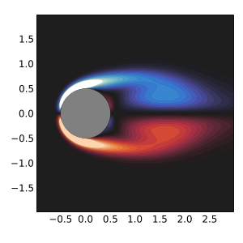
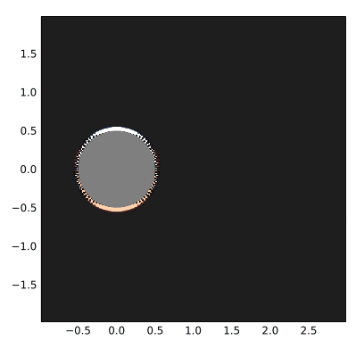
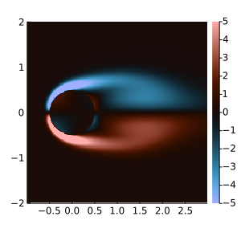

## Example 1: Cylinder

In this example, we will simulate the flow past a cylinder. The general workflow is:
- Define the problem
    - Grid
    - Bodies
    - Time step & span
    - Freestream velocity
    - Reynold's number
- Solve the problem
- Use the results

### Defining the Problem

```julia
using IBPM
```

The first step is to define the grid.

```julia
Δx = 0.02           # Grid step size
mg = 3              # Number of sub-domains
xlim = (-1.0, 3.0)  # Grid x limits
ylim = (-2.0, 2.0)  # Grid y limits
mgrid = MultiGrid(Δx, (xlim, ylim); mg=mg)
```

Then, we define the bodies. In this case, we use a single cylinder with radius `0.5` as our body.

```julia
r = 0.5
bodies = [IBPM.make_cylinder(r, Δx, 0.0, 0.0)]
```

Then, the remaining quantities are specified and the [`IBProblem`](@ref) is constructed.

```julia
T = 5.0     # Final time
Δt = 0.004  # Time step size
Re = 100.0  # Reynolds number
freestream(t) = (1.0, 0.0)  # Freestream velocity as a function of time

prob = IBProblem(mgrid, bodies, (0, T), Δt; Re, freestream)
```

The [`solve`](@ref) function solves the problem. During the solving process, an
[`IBState`](@ref) holds information about the flow and bodies. The final state
is returned after solving:

```julia
final_state = solve(prob)
```

The interesting stuff tends to happen _during_ the simulation, so let's see how
we retrive data from the solver.

### Basic Callbacks

[`solve`](@ref) optionally takes a callback as its first argument which is
called with each iterations' time and [`IBState`](@ref).

```julia-repl
julia> callback(t, state) = @show t;

julia> solve(callback, prob);
t = 0.0
t = 0.004
t = 0.008
t = 0.012
...
t = 4.988
t = 4.992
t = 4.996
t = 5.0
```

Julia's [do block](https://docs.julialang.org/en/v1/manual/functions/#Do-Block-Syntax-for-Function-Arguments)
syntax allows us rewrite this as:

```julia
solve(prob) do t, state
    @show t
end
```

These callbacks run at every iteration. In order to run a callback at certain
times, you can use a [`StateCallback`](@ref). The `at` keyword argument
specifies which times to save at (in increasing order).

```julia
printer = StateCallback(prob; at=[1.0, 2.0]) do t, state
    @show t
end
```

Any amount of [`StateCallback`](@ref)s can be passed to `solve`:

```julia-repl
julia> solve(prob, [printer]);
t = 1.0
t = 2.0
```

### Plotting

IBPM comes with built-in plotting recipes for the
[`Plots`](https://docs.juliaplots.org/stable/) package.

```julia
using Plots
```

Plotting works with quantities from the [`IBPM.Quantities`](@ref) module. For more
information about this module, see the next section. To plot `quantity` for some `state`,
the signature is:

```julia
plot(prob, state, quantity; [subgrids], ...)
```

The `subgrids` keyword argument optionally specifies a range of subgrids to
include. For example, `1:2` includes the first 2 subgrids. Additional keyword
arguments are passed to Plots. To plot the vorticity and bodies:

```julia
using IBPM.Quantities: vorticity, body_points

plot(prob, final_state, vorticity; subgrids=1:1, clims=(-5, 5), size=(300, 300))
plot!(prob, final_state, body_points; linealpha=0, color=:gray)
```



A simple animation can be made by combining Plots'
[`Animation`](https://docs.juliaplots.org/latest/animations/#animations) with
IBPM's [`StateCallback`](@ref).

```julia
anim = Animation()

save_anim = StateCallback(prob; at=range(0, T, 90)) do t, state
    # Plot the vorticity
    plot(prob, state, vorticity; subgrids=1:1, clims=(-5, 5), size=(400, 400))
    # Plot the cylinder
    plot!(prob, state, body_points; fillcolor=:gray, linealpha=0)
    # Save an animation frame
    frame(anim)
end

solve(prob, [save_anim])

gif(anim; fps=15)
```



### Quantities and Callbacks

The [`IBPM.Quantities`](@ref) module defines functions for retrieving
quantities from an [`IBState`](@ref).

```julia
using IBPM.Quantities: drag_coef, lift_coef
```

Each function can be called as `quantity(state)` to get the relevant quantity from an
[`IBState`](@ref). To get the drag coefficient from the final state, for example:

```julia-repl
julia> drag_coef(final_state)
1-element Vector{Float64}:
 1.3650736887338673
```

`drag_coef` returns a vector of drag coefficients for each body. In this case,
there's only one body. We can use these quantity functions inside a
[`StateCallback`](@ref) to display info during the simulation. The following
callback prints the time, drag coefficient, and lift coefficient at the
10th and 11th time steps.

```julia
using Printf

printerA = StateCallback(prob; at=[10Δt, 11Δt]) do t, state
    CD = drag_coef(state)
    CL = lift_coef(state)
    @printf "(A)  t = %.3f  C_D = %.3f  C_L = %+.3e\n" t CD[1] CL[1]
end
```

Instead of manually calling `drag_coef(state)`, you can pass any amount of
quantities after `prob` and the callback will be called with those quantities.
`printerA` is equivalent to:

```julia
printerA = StateCallback(prob, drag_coef, lift_coef; at=[10Δt, 11Δt]) do t, CD, CL
    @printf "(A)  t = %.3f  C_D = %.3f  C_L = %+.3e\n" t CD[1] CL[1]
end
```

By default, the times in `at` are rounded to the nearest time step. In order to
force interpolation, you can add the keyword `interp=InterpQuadratic()`. The
following callback prints the drag and lift coefficients between the
10th and 11th time steps.

```julia
printerB = StateCallback(
    prob, drag_coef, lift_coef; at=[10.5Δt], interp=InterpQuadratic()
) do t, CD, CL
    @printf "(B)  t = %.3f  C_D = %.3f  C_L = %+.3e\n" t CD[1] CL[1]
end
```

Quantity functions passed to [`StateCallback`](@ref) don't have to be from
[`IBPM.Quantities`](@ref). Any function `f(state)` or `f(t, state)` works. For
example, you can specify the lift to drag ratio as a quantity:

```julia
lift_to_drag(state) = lift_coef(state)[1] / drag_coef(state)[1]

printerC = StateCallback(prob, lift_to_drag; at=3.0:4.0) do t, L_to_D
    @printf "(C)  t = %.3f  L/D = %.3f\n" t L_to_D
end
```

Showing these callbacks in action:

```julia-repl
julia> solve(prob, [printerA, printerB, printerC]);
(A)  t = 0.040  C_D = 3.461  C_L = -7.355e-10
(A)  t = 0.044  C_D = 3.290  C_L = -6.385e-10
(B)  t = 0.042  C_D = 3.369  C_L = -6.841e-10
(C)  t = 3.000  L/D = 0.000
(C)  t = 4.000  L/D = 0.000
```

### Saving Data

[`StateData`](@ref) provides a convenient way to save data during the solving
process. To get the drag coefficient of the first (and only) body, you can do:

```julia-repl
julia> drag = StateData{Float64}(
           state -> drag_coef(state)[1],
           prob;
           saveat=1.0:4.0
       )
0-element StateData{Float64, Vector{Float64}}
```

`drag` is initially empty. The [`saveto!`](@ref) function creates a
[`StateCallback`](@ref) that populates the data. This callback can be passed to
[`solve`](@ref) like any other callback.

```julia
solve(prob, [saveto!(drag)])
```

Now, `drag` is populated. The `drag.t` field gives the corresponding times of each element.

```julia-repl
julia> @show drag drag.t;
drag = [1.5491422637258554, 1.5550047161715392, 1.4734210572069826, 1.4099564231779713]
drag.t = [1.0, 2.0, 3.0, 4.0]

julia> (drag.t[2], drag[2])
(2.0, 1.5550047161715392)
```

### Grid Quantities

Quantities that apply over the entire grid, like `vorticity`, return arrays.
The last dimension of these arrays specify the subgrid. For example, to get the
vorticity on the first subgrid:

```julia-repl
julia> ω = @view vorticity(final_state)[:, :, 1];

julia> size(ω)
(199, 199)
```

[`gridranges`](@ref) gets the x and y coordinates that correspond to each subgrid.

```julia-repl
julia> using IBPM.Quantities: gridranges

julia> ranges = gridranges(vorticity, prob; subgrids=1:2);

julia> foreach(println, ranges)
(-0.98:0.02:2.98, -1.98:0.02:1.98)
(-2.96:0.04:4.96, -3.96:0.04:3.96)
```

Since `ω` applies only to the first subgrid, take `ranges[1]`:

```julia-repl
julia> x, y = ranges[1]
(-0.98:0.02:2.98, -1.98:0.02:1.98)
```

Now, the vorticity at `(x[i], y[j])` is `ω[i, j]`. To plot the vorticity
without using IBPM's built-in recipes, you could do:

```julia
heatmap(
    x, y, transpose(ω);
    color=:berlin, clims=(-5, 5), aspect_ratio=:equal, size=(300, 300)
)
```


